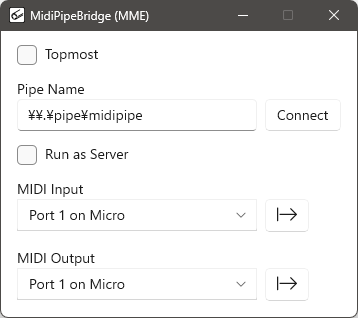
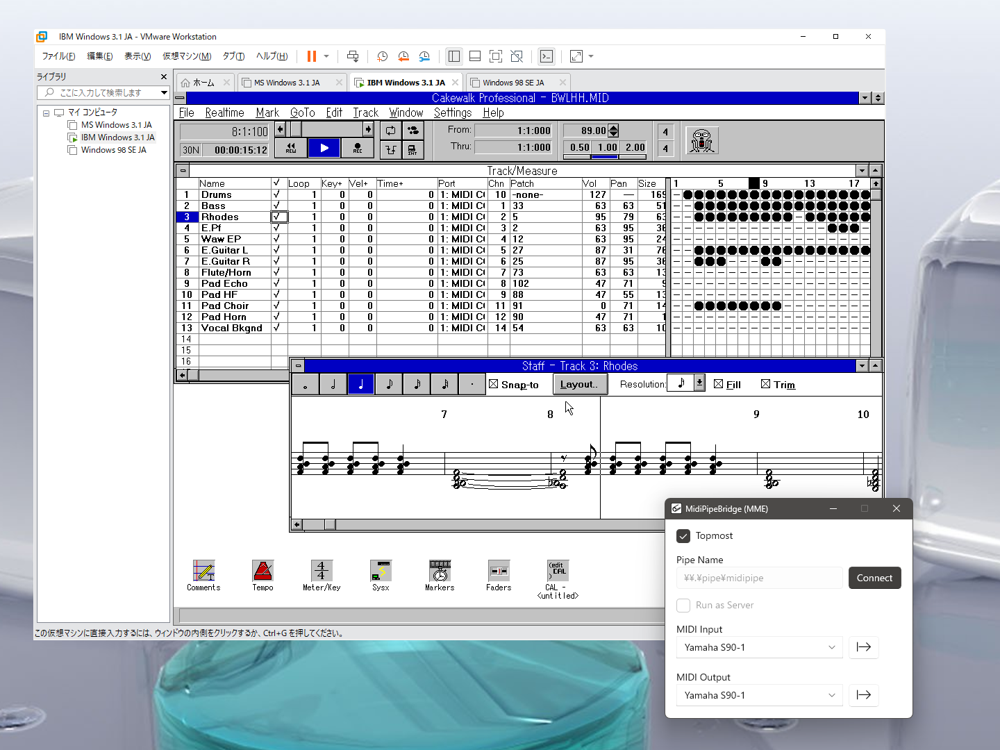

# MidiPipeBridge
 

## What is this?

これはMIDIデバイスと名前付きパイプの間で全二重バイトストリームを受け渡す単純なツールである。  
モダンなGUIのためにWindows App SDK、WinUI 3、C++/WinRTを採用し、非パッケージアプリとした。

This is a simple tool that transfers a full-duplex byte stream between MIDI devices and a named pipe.  
It utilizes Windows App SDK, WinUI 3, and C++/WinRT for a modern GUI and made it a non-packaged app.

## Purpose and Background

1990年代、多くの人々がPC上で音楽を製作するようになったが、当時のPCがMIDIで通信するためには追加のインターフェースハードウェアが必要だった。機能的にMIDIと近い調歩同期通信が可能なシリアルポートは存在したが、標準的なシリアルポートはMIDI規格に必要なボーレートを生成できなかった。そのため、DTM向け機材の多くは直接PCのシリアルポートと接続できる特別な「シリアルMIDIポート」を備えるようになり、それらを活用するための「シリアルMIDIドライバ」が提供された。  
現在では仮想化ソフトウェアを利用して古いOSを稼働することができる。これらの仮想化ソフトウェアは、たいてい名前付きパイプを通じてゲスト環境のシリアルポートをホスト環境と繋ぐ機能を備えている。  
ここで、ホスト環境の上で名前付きパイプとMIDIポートを接続する方法があれば、ゲスト環境で動く古いMIDIソフトウェアを外の世界と繋げることが出来る。そういうわけで、そのようなプログラムを書いた。

In the 1990s, many people began to create music on their PCs, but at that time PCs required additional interface hardware to communicate via MIDI. Serial ports capable of asynchronous communication functions similar to MIDI existed, but standard serial ports could not generate the baud rate required by the MIDI standard. As a result, many DTM-oriented devices were equipped with special “serial MIDI ports” that could be connected directly to PC serial ports, and “serial MIDI drivers” were provided to utilize them.  
Today, virtualization software can be used to run older operating systems. These virtualization software usually have the feature of connecting the serial port of the guest environment to the host environment through a named pipe.  
Here, if there is a way to connect a named pipe and a MIDI port on the host environment, it would be possible to connect old MIDI software running in the guest environment to the outside world. So, I wrote such a program.

Cakewalk Professional 1.0 on Windows 3.1 on VMware Workstation with "MidiPipeBridge" on Windows 11

## MIDI API Versions

当初、WinRT MIDI APIを利用してみたが、いくつかの不具合を見つけたため古いMME APIを利用したバージョンも書いた。

Initially, I tried using the WinRT MIDI API, but found some problems, so I wrote a version using the legacy MME API.

| API | pros | cons |
|--|--|--|
| WinRT MIDI | * modern and easy to use * hot plugging supported🙂 | * device names are difficult to identify * non-MIDI devices are mistakenly listed * some devices are not listed😡 |
| MME MIDI | easily identifiable device names | does not support hot plugging |

## Requirement

### Build environment

build tool:
- Visual Studio 2022 17.4 or later  
with compiler option /std:c++20

NuGet packages (These packages can be downloaded automatically with NuGet):
- Microsoft.Windows.CppWinRT 2.0.240405.15
- Microsoft.Windows.ImplementationLibrary 1.0.240803.1
- Microsoft.WindowsAppSDK 1.6.240829007

### Target environment

- Windows 10, version 1809 (10.0; Build 17763) or later
- [Windows App SDK runtime](https://learn.microsoft.com/en-us/windows/apps/windows-app-sdk/downloads) 1.6.0
- Your preferred MIDI hardware and software environment🙂

## Written by

[yu2924](https://twitter.com/yu2924)

## License

CC0 1.0 Universal
